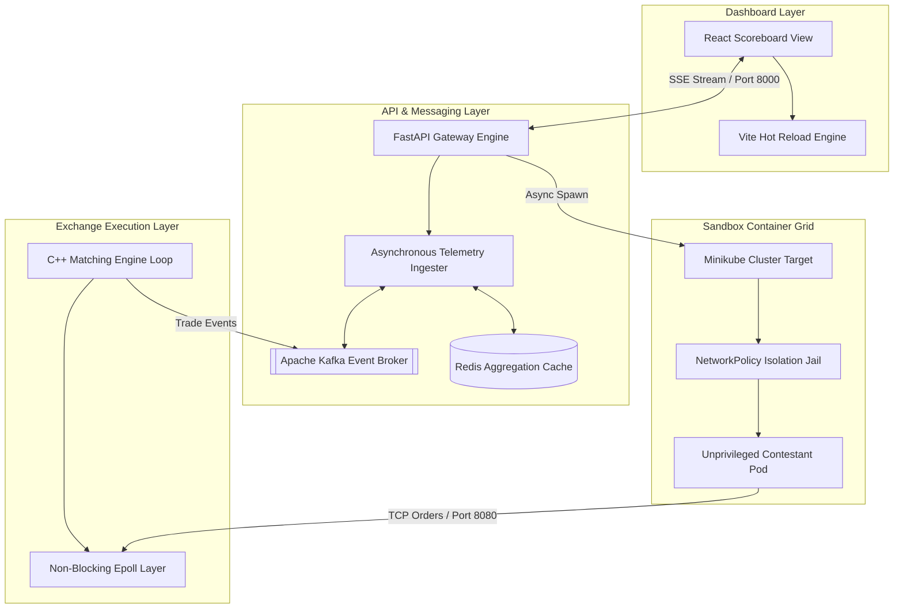

# High-Frequency Trading (HFT) Market Simulator & Sandbox Platform

[](#)
[](#)
[](#)
[](#)
[](#)
[](#)
[](#)

The HFT Market Simulator is a real-time distributed trading platform evaluation mesh. It automatically compiles, sandboxes, and benchmarks polyglot algorithmic trading agents (Python, C++, Go, Rust) against a low-latency native C++ matching engine loop. Telemetry is streamed dynamically to provide sub-microsecond latency analytics and order-book metrics.


### Few endpoint errors are still being fixed 

---

## Architecture Overview

The platform uses a decoupled distributed pipeline to ensure high throughput and uncompromised evaluation accuracy. The frontend tracking dashboard visualizes live scores, throughput (TPS), and tail-latency percentiles via standard SSE (Server-Sent Events). The async FastAPI backend ingests submission packages, while a dedicated Kubernetes controller manages unprivileged container lifecycles within hardened isolation cells.



## How Local Isolation Powers the Sandbox

The platform utilizes a customized **Kubernetes Orchestration Controller** via the native `kubernetes-client` Python SDK. Instead of exposing the host operating system to arbitrary contestant code executions, the orchestrator walks through unzipped workspaces recursively, identifies the source language rules, and multi-stage compiles an unprivileged container on the fly.

These sandboxed containers are dropped directly into a rigid Kubernetes `Namespace` wrapped inside a strict egress `NetworkPolicy`. This prison mesh blocks all external internet requests, while bridging back to the matching engine on the host via the `EXCHANGE_HOST` gateway address (default `10.0.2.2` for VM-based Minikube drivers; configurable for the Docker driver — see setup instructions).

## Key Features

* **Polyglot Compilation Deck:** Automatically parses project workspaces to containerize Python, Rust, Go, or C++ source zips dynamically.
* **Low-Latency Matching Core:** A multi-threaded C++ exchange application using a non-blocking Linux `epoll` socket stack to minimize jitter.
* **Live Metrics Streaming:** Computes real-time P50, P90, and P99 execution latency brackets and streams updates via Server-Sent Events (SSE).
* **Theme-Aware Interface:** A high-density dashboard built to monitor total fills, order book depths, and comparative rank standings instantly.

---

## Setup and Installation

### Prerequisites

1. **Linux Host Environment** (Ubuntu/Debian or Arch Linux)
2. **Docker Engine** and **Docker Compose** (v2)
3. **Minikube** installed and on your system path
4. **Python 3.11+** with `pip` (for the orchestrator, which runs on the host)

### Startup

**Step 1 — Install orchestrator dependencies**
```bash
git clone https://github.com/HegdeShreyas14/trade_plat.git
cd trade_plat
pip install -r infra/requirements.txt
```

**Step 2 — Start Minikube and point Docker at its daemon**

The matching engine image must be built inside Minikube's Docker daemon so K8s can pull it without a registry. Run these two commands **before** `docker compose`:
```bash
minikube start --driver=docker
eval $(minikube docker-env)
```

> **Docker driver on Linux only:** the default host gateway address `10.0.2.2` does not apply with this driver. Export the correct host IP so bot pods can reach the matching engine:
> ```bash
> export EXCHANGE_HOST=$(minikube ssh -- ip route show default | awk '{print $3}')
> ```

**Step 3 — Bring up the full stack**
```bash
docker compose up -d
```

This single command builds and starts everything:
- Apache Kafka + Zookeeper
- Redis
- C++ matching engine (port 8080)
- Telemetry / scoring API (port 8000)
- React leaderboard frontend (port 5173)

Wait ~30 seconds for Kafka to become healthy, then open:

* **Dashboard UI:** http://localhost:5173
* **Gateway API:** http://localhost:8000

### Submitting a bot

1. Open http://localhost:5173
2. Enter a unique contestant name in the text field
3. Upload a `.zip` containing your trading logic

The zip must include:
- `sandbox_sdk.py` — copied from `sample_bot/sandbox_sdk.py` (platform harness, do not modify)
- `solution.py` — your code; must define `on_market_update(market_tick, exchange)`
- `requirements.txt` — any extra pip dependencies

The `on_market_update` callback receives a simulated market tick and an `exchange` handle. Call `exchange.submit_order("BUY" | "SELL", price, quantity)` to place orders. Scores appear on the leaderboard in real time.

### Checking service health
```bash
docker compose ps
docker compose logs matching-engine
docker compose logs telemetry-api
```


---

## API Reference

| Endpoint | Method | Description |
| --- | --- | --- |
| `/api/v1/leaderboard` | `GET` | Returns instant snapshot cache records of running contestant scores. |
| `/api/v1/leaderboard/stream` | `GET` | Establishes persistent Server-Sent Events (SSE) telemetry data pipelines. |
| `/api/v1/submissions/upload` | `POST` | Ingests contestant code archives, runs unzipped walkers, and triggers async builds. |
| `/health` | `GET` | Verification path confirming cluster API layer connectivity states. |

---

## Design System Reference

| Element | Description |
| --- | --- |
| **Typography** | Inter (UI metric modules), JetBrains Mono (Leaderboard tables, console log dumps) |
| **Color Space** | Primary dark slate theme backdrop, Emerald active status nodes, Amber parsing tickers, Burnt Orange latency profiling strokes. |
| **UX Highlights** | Glassmorphism dashboard panel elements, micro-glow connection indicators, and low-overhead viewport component rendering loops. |


