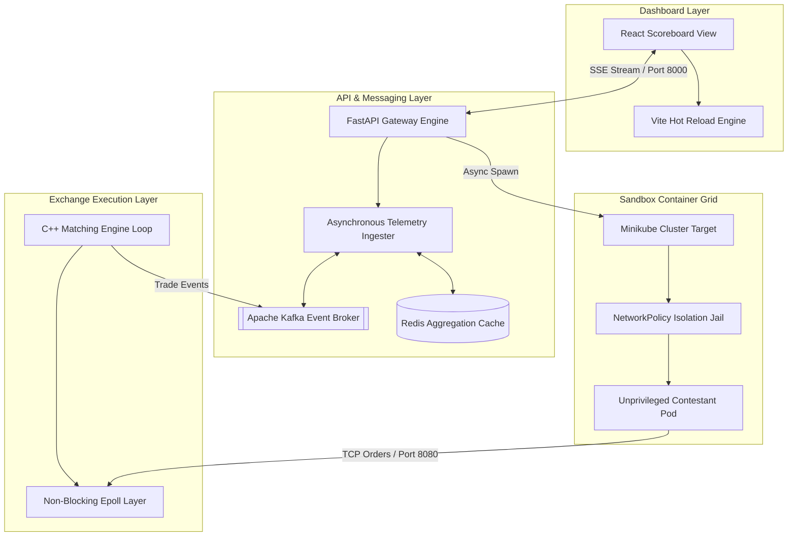

# High-Frequency Trading (HFT) Market Simulator & Sandbox Platform

[](#)
[](#)
[](#)
[](#)
[](#)
[](#)
[](#)

The HFT Market Simulator is a real-time distributed trading platform evaluation mesh. It automatically compiles, sandboxes, and benchmarks polyglot algorithmic trading agents (Python, C++, Go, Rust) against a low-latency native C++ matching engine loop. Telemetry is streamed dynamically to provide sub-microsecond latency analytics and order-book metrics.


### Few endpoint errors are still being fixed 

---

## Architecture Overview

The platform uses a decoupled distributed pipeline to ensure high throughput and uncompromised evaluation accuracy. The frontend tracking dashboard visualizes live scores, throughput (TPS), and tail-latency percentiles via standard SSE (Server-Sent Events). The async FastAPI backend ingests submission packages, while a dedicated Kubernetes controller manages unprivileged container lifecycles within hardened isolation cells.



## How Local Isolation Powers the Sandbox

The platform utilizes a customized **Kubernetes Orchestration Controller** via the native `kubernetes-client` Python SDK. Instead of exposing the host operating system to arbitrary contestant code executions, the orchestrator walks through unzipped workspaces recursively, identifies the source language rules, and multi-stage compiles an unprivileged container on the fly.

These sandboxed containers are dropped directly into a rigid Kubernetes `Namespace` wrapped inside an strict egress `NetworkPolicy`. This prison mesh blocks all external internet requests, while bridging an internal loopback tunnel (`10.0.2.2:8080`) straight to the matching engine core, ensuring deterministic throughput without network contamination.

## Key Features

* **Polyglot Compilation Deck:** Automatically parses project workspaces to containerize Python, Rust, Go, or C++ source zips dynamically.
* **Low-Latency Matching Core:** A multi-threaded C++ exchange application using a non-blocking Linux `epoll` socket stack to minimize jitter.
* **Live Metrics Streaming:** Computes real-time P50, P90, and P99 execution latency brackets and streams updates via Server-Sent Events (SSE).
* **Theme-Aware Interface:** A high-density dashboard built to monitor total fills, order book depths, and comparative rank standings instantly.

---

## Setup and Installation

### Prerequisites

1. **Linux Host Environment** (Ubuntu/Debian or Arch Linux)
2. **Docker Engine** and **Docker Compose**
3. **Minikube** installed and verified on your local system path.
4. **Python 3.11+** and **G++ Compiler** (supporting C++17/C++20 layout flags).

### Local Development

1. **Clone and Install System Dependencies**
```bash
git clone [https://github.com/HegdeShreyas14/trade_plat.git](https://github.com/HegdeShreyas14/trade_plat.git)
cd trade_plat

# Install backend python execution frameworks
pip install -r telemetry/requirements.txt
pip install -r infra/requirements.txt

```


2. **Initialize Virtual Cluster Infrastructure**
```bash
# Spin up single-node cluster utilizing your docker runtime
minikube start --driver=docker

# CRITICAL STEP: Configure current terminal shell variables to map to Minikube's Docker daemon
eval $(minikube docker-env)

# Bring up background caching brokers and event message channels
docker compose up -d

```


3. **Build and Run the C++ Matching Engine**
```bash
cd matching-engine/
g++ -std=c++17 -O3 -DNDEBUG -pthread main.cpp MatchingEngine.cpp Order.cpp networking/TCPServer.cpp -o engine
./engine

```


4. **Launch the Telemetry & API Framework**
Open a separate terminal pane (**ensuring you re-run `eval $(minikube docker-env)` inside it to inherit Minikube's context**):
```bash
# Start the continuous event streaming consumer ingester
python3 telemetry/ingester.py --disable-timescale

# Run the hot-reloading FastAPI application gateway bounded to localhost
uvicorn telemetry.api:app --host localhost --port 8000 --reload

```


5. **Start the Frontend Dashboard**
```bash
cd frontend/
npm install
npm run dev -- --force

```


* **Dashboard UI:** http://localhost:5173
* **Gateway API:** http://localhost:8000


---

## API Reference

| Endpoint | Method | Description |
| --- | --- | --- |
| `/api/v1/leaderboard` | `GET` | Returns instant snapshot cache records of running contestant scores. |
| `/api/v1/leaderboard/stream` | `GET` | Establishes persistent Server-Sent Events (SSE) telemetry data pipelines. |
| `/api/v1/submissions/upload` | `POST` | Ingests contestant code archives, runs unzipped walkers, and triggers async builds. |
| `/health` | `GET` | Verification path confirming cluster API layer connectivity states. |

---

## Design System Reference

| Element | Description |
| --- | --- |
| **Typography** | Inter (UI metric modules), JetBrains Mono (Leaderboard tables, console log dumps) |
| **Color Space** | Primary dark slate theme backdrop, Emerald active status nodes, Amber parsing tickers, Burnt Orange latency profiling strokes. |
| **UX Highlights** | Glassmorphism dashboard panel elements, micro-glow connection indicators, and low-overhead viewport component rendering loops. |


